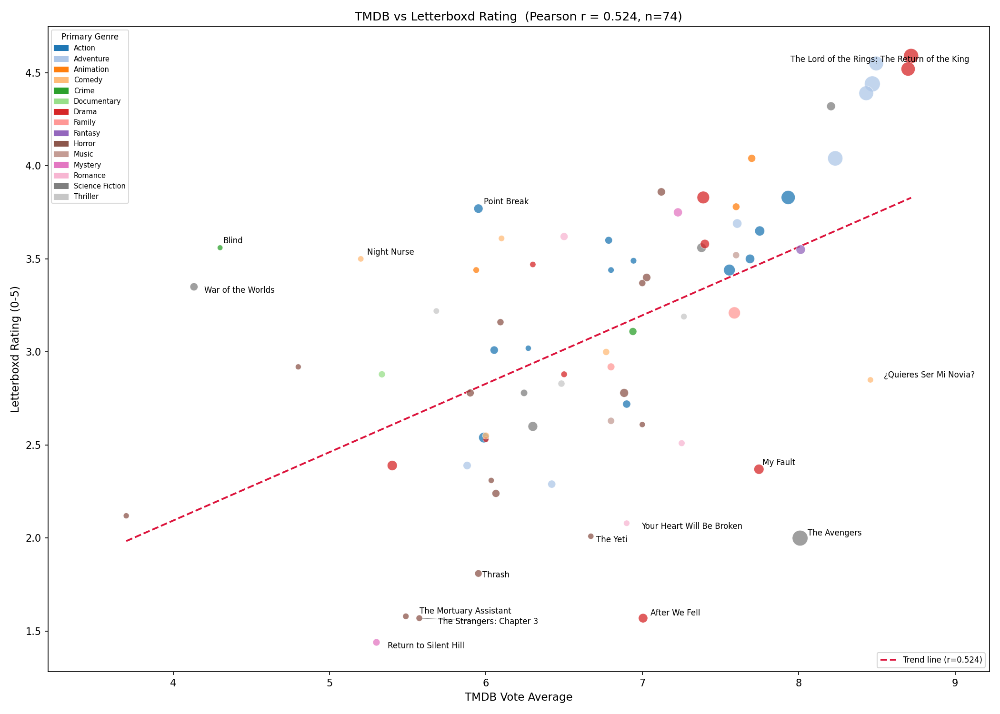
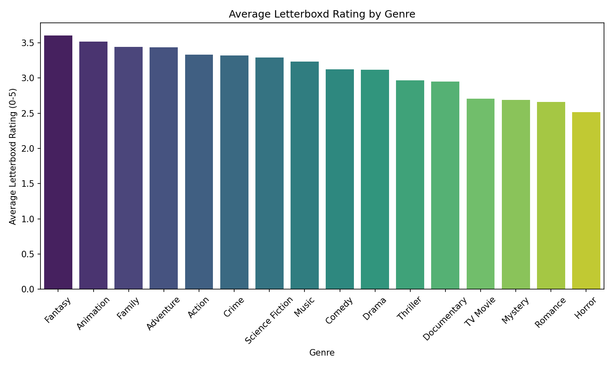
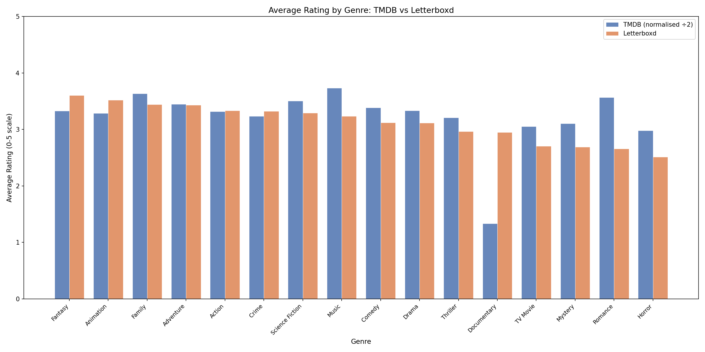
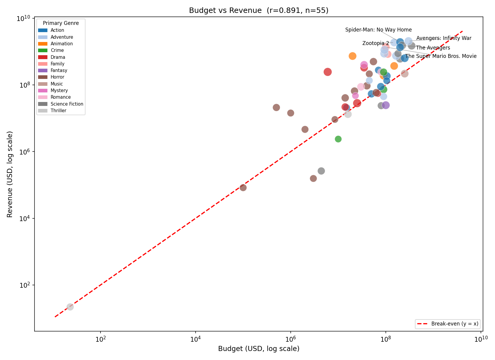

# Analysis Report — TMDB & Letterboxd Movie Dataset

**Course:** UCLA STAT 418 — Tools in Data Science  
**Student:** Rohan Narasayya (rnarasay@ucla.edu)  
**Data collected:** April 2026

---

## 1. Data Collection Summary

| Metric | Value |
|---|---|
| Movies fetched from TMDB API | 100 |
| TMDB API calls made | ~305 (5 popular-page calls + 3 per movie) |
| Letterboxd pages scraped | 100 |
| Movies with lb_rating | 75 / 100 |
| Letterboxd 404 errors | 5 |
| Movies with no meta tag (new/obscure titles) | 20 |
| Movies with budget and revenue data | 55 / 100 |
| Release date range | 1972-03-14 to 2026-10-09 |
| Unique genres | 18 |
| Languages represented | 13 (English 78%, plus Spanish, Italian, Filipino, Japanese, Chinese, Hindi, and 6 others) |
| Average TMDB rating | 6.47 / 10 |
| Average Letterboxd rating | 3.10 / 5 |

Movies were sampled from the TMDB "popular" endpoint across 5 pages (20 movies per page). Each movie required three API calls: details, credits, and external IDs. The Letterboxd scraper derived a URL slug from each title (lowercase, non-alphanumeric characters replaced with hyphens) and extracted the weighted average rating from the `<meta name="twitter:data2">` server-side tag, which is stable across site deploys. Two movies had a TMDB `vote_average` of 0 (no community votes recorded yet) and are excluded from the rating correlation plot.

---

## 2. Analysis Findings

### 2.1 TMDB vs Letterboxd Rating Correlation

The scatter plot shows a **moderate positive correlation (Pearson r = 0.52, n = 74)** between TMDB vote averages and Letterboxd ratings, indicating that the two platforms broadly agree on film quality but diverge more than two platforms serving similar audiences typically would. TMDB ratings average 6.47/10 (3.24 on a 0–5 scale) while Letterboxd averages 3.10/5 — a gap of 0.14 scale-points — suggesting Letterboxd's more cinephile-oriented user base applies somewhat stricter standards. Points sized by TMDB vote count show that high-consensus blockbusters cluster tightly along the trend line, while newly released or obscure titles with fewer votes scatter more widely.

### 2.2 Average Letterboxd Rating by Genre

Among the 16 genres with Letterboxd ratings, **Fantasy (3.60), Animation (3.52), and Family (3.44)** achieve the highest average scores, while **Horror (2.51), Romance (2.66), and Mystery (2.69)** rank lowest. The genre counts provide important context: Horror (27 tagged movies) and Thriller (31) are the two most common genres in the dataset, and both contain a large number of low-rated direct-to-streaming releases that drag their averages down. Fantasy and Animation, by contrast, are represented by fewer titles that tend to be major studio releases with strong audience reception.

### 2.3 TMDB vs Letterboxd Rating by Genre (Comparison)

With TMDB `vote_average` divided by 2 to bring it onto the same 0–5 scale as Letterboxd, the grouped bar chart reveals a striking anomaly: **Documentary** is the only genre where Letterboxd (2.95) substantially outrates the normalized TMDB average (1.33). This is almost certainly a data artifact — the one or two Documentary-tagged movies in the dataset have very low TMDB vote counts, so their averages are volatile, while Letterboxd's larger and more engaged user base produces a more stable score. For most genres the two platforms agree to within 0.3 points, though TMDB consistently rates **Music** and **Family** films higher than Letterboxd does, while Letterboxd edges TMDB on **Fantasy** and **Animation**.

### 2.4 Budget vs Revenue

Among the 55 movies with known financial data, there is a **very strong log-scale correlation between budget and revenue (Pearson r = 0.89)**, confirming that higher production investment reliably predicts higher box-office returns at the order-of-magnitude level. Nearly all data points fall above the red break-even line (y = x), reflecting the popularity bias of the dataset toward successfully distributed studio releases. The five most profitable films — Avengers: Infinity War ($1.75 B profit), Spider-Man: No Way Home ($1.72 B), Zootopia 2 ($1.72 B), The Avengers ($1.30 B), and The Super Mario Bros. Movie ($1.26 B) — are annotated in the top-right quadrant; all are franchise or sequel entries, reinforcing the pattern that pre-built audience recognition drives outsized returns.

---

## 3. Interesting Patterns

**The TMDB–Letterboxd correlation is only moderate (r = 0.52).** Despite both platforms collecting user ratings for the same films, they agree less strongly than one might expect. The gap is widest for newly released titles with few Letterboxd ratings and for non-English-language films where TMDB's globally diverse voter pool diverges from Letterboxd's predominantly Western cinephile community.

**Documentary is a statistical outlier in the genre comparison.** The normalized TMDB average for Documentary-tagged films (1.33/5) is dramatically lower than the Letterboxd average (2.95/5). This is caused by one or two Documentary-tagged titles having near-zero TMDB vote counts, producing unstable means — a reminder that per-genre statistics are unreliable when genre coverage in a popularity-sampled dataset is thin.

**Franchise sequels dominate the profitable tier.** All five of the most profitable movies are sequels or franchise entries (MCU, Disney Animation, Nintendo). Three of the five — Avengers: Infinity War, Spider-Man: No Way Home, and The Avengers — are Marvel Cinematic Universe films, and Zootopia 2 appears alongside them despite releasing in 2025, indicating that brand equity built over decades continues to translate into nine-figure profits for established IP.

**Horror and Thriller are the most common genres but among the worst-rated.** With 27 Horror and 31 Thriller tags in a 100-movie dataset, these genres make up over a quarter of all genre assignments, yet they rank 16th and 11th of 16 by Letterboxd average (2.51 and 2.97 respectively). TMDB's popular endpoint surfaces recently released streaming content, and many lower-quality VOD titles in these genres appear briefly on the popularity list around their release date, inflating their representation while dragging down genre averages.

**22% of the dataset is non-English.** 22 movies across 12 non-English languages were collected, demonstrating TMDB's global user base surfaces international content alongside Hollywood releases. Filipino (Tagalog, 3 films), Spanish (4 films), and Italian (3 films) are the most represented non-English languages.

---

## 4. Challenges and Solutions

### Letterboxd slug mismatches (5 × HTTP 404)

The slug derivation rule (lowercase + replace non-alphanumeric with hyphens) does not always match Letterboxd's actual URL. For example, `"Lee Cronin's The Mummy"` slugifies to `"lee-cronin-s-the-mummy"` but Letterboxd may store it under a different path or not have it at all. `"Now You See Me: Now You Don't"` contains a curly apostrophe that the slug function strips inconsistently across locales.

**Solution:** The scraper logs HTTP 404 errors and returns `{"error": "HTTP 404"}` without crashing, leaving `lb_rating = NaN` for affected movies. Future work could implement a search-based fallback (query Letterboxd's search endpoint for the title and year, then follow the first result URL).

### Movies missing the rating meta tag (20 titles)

A further 20 movies returned HTTP 200 pages but contained no `<meta name="twitter:data2">` tag. These are typically very new releases (e.g., 2025–2026 titles with fewer than a few hundred Letterboxd entries) where the weighted average has not yet been computed and published by Letterboxd.

**Solution:** Both extractors are wrapped in individual `try/except` blocks, returning `None` on any parsing failure. The merge step preserves these rows with `lb_rating = NaN` so TMDB data is not lost.

### TMDB movies with zero vote_average

Two movies in the collected set had `vote_average = 0.0` — TMDB's representation of "no votes yet." Including them in the rating correlation plot placed a point at x = 0, stretching the x-axis from 0 to 10 and creating misleading whitespace across the bulk of the data.

**Solution:** The correlation analysis filters `vote_average > 0` before plotting, reducing the plotted count from 75 to 74. The zero-vote movies remain in all other analyses (genre, financial) where vote_average is not plotted on an axis.

### TMDB missing financial data

TMDB stores `0` for unknown budget and revenue values. Only 55 of 100 movies (55%) have usable financial figures, and these are disproportionately major studio theatrical releases. Independent films, streaming-only titles, and foreign-language productions rarely disclose financial details to TMDB.

**Solution:** The data processor replaces `0` budget/revenue with `NaN` and the financial analysis filters to rows where both values are strictly positive. All affected movies remain in the dataset for non-financial analyses.

### Letterboxd robots.txt — urllib vs requests user-agent mismatch

Python's built-in `urllib.robotparser.RobotFileParser.read()` fetches `robots.txt` without a custom User-Agent header. Letterboxd returns HTTP 403 to Python's default `urllib` agent, causing `RobotFileParser` to set `disallow_all = True` and incorrectly block all scraping.

**Solution:** `check_robots_txt()` fetches the robots.txt text using `requests` with the project User-Agent (which receives HTTP 200), then feeds the raw text into `RobotFileParser.parse()` directly. The `/film/` path is confirmed allowed under the `*` wildcard ruleset.

---

## 5. Limitations and Future Improvements

**Popularity sampling bias.** The dataset is drawn exclusively from TMDB's "popular right now" list at one point in time. It overrepresents recently released theatrical and streaming titles and is not a random or genre-stratified sample. Conclusions about "cinema as a whole" cannot be drawn from it.

**Letterboxd coverage gaps.** 25% of movies have no Letterboxd rating, concentrated among very new releases and niche titles. Any genre-level conclusions based on Letterboxd ratings are further attenuated by this selection effect.

**Missing financial data.** The 55% coverage of budget and revenue skews the financial analysis toward large-budget studio films. No inflation adjustment is applied, making cross-decade budget comparisons nominal rather than real.

**Fan count unavailable.** The Letterboxd fan count field was `None` for all 100 movies — this figure is rendered client-side via JavaScript and is not present in the server-rendered HTML that the scraper reads. A headless browser (e.g. Playwright) could retrieve it at the cost of much slower scraping.

**Future improvements:**

- Collect from multiple TMDB endpoints (top-rated, by genre, by decade) to build a more representative sample.
- Implement a Letterboxd search fallback for slug-mismatch 404s: query `/search/?q={title}` and follow the first matching film link.
- Add a Playwright-based fan count extraction step, run once per title, with results cached to disk.
- Add inflation-adjusted budget and revenue using CPI data for meaningful cross-decade financial comparisons.
- Automate re-collection on a weekly schedule to build a longitudinal dataset tracking how ratings evolve after release.
